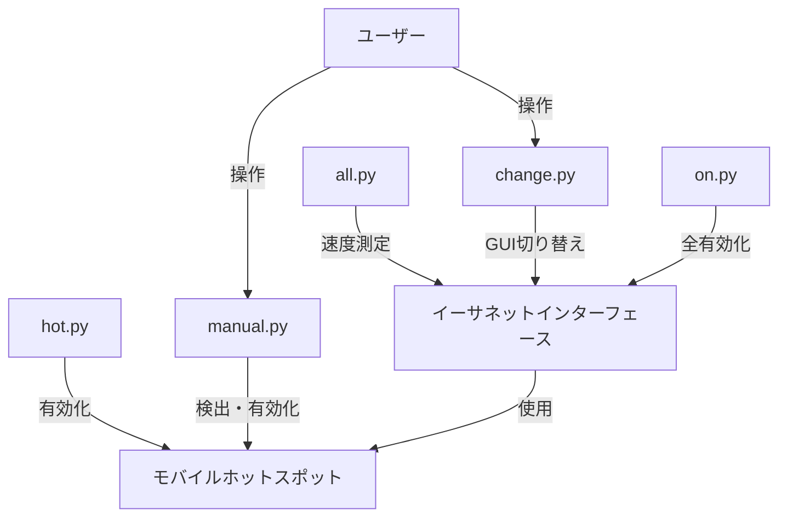

# BestEthernet

BestEthernetは、Pythonを使用してイーサネット接続の速度を測定し、最も高速な接続を自動的に選択するツールです。USBテザリングを有効にし、利用可能なイーサネット接続の中から最速のものを選択してアクティブにします。

## 主な機能

- USBテザリングの有効化
- 利用可能なイーサネット接続のリストアップ
- 各イーサネット接続のダウンロードおよびアップロード速度の測定
- 最速のイーサネット接続の自動選択とアクティブ化
- 速度測定結果のログ記録
- モバイルホットスポットの有効化

## ファイル構成と機能

### all.py
- 機能: 全イーサネットインターフェースの速度測定と最速選択
- 出力: 速度ログ（txt, csv）

### change.py
- 機能: GUI経由でイーサネットインターフェース切り替え
- 入力: ユーザー選択

### hot.py
- 機能: Windows 10モバイルホットスポット開始
- 出力: 結果表示または設定画面起動

### on.py
- 機能: 全イーサネットインターフェース有効化
- 出力: 処理結果

### manual.py
- 機能: モバイルホットスポット可能インターフェース検出と有効化
- 入力: GUI経由のユーザー選択
- 出力: 処理結果

## システム構成図

## 注意事項

- 全スクリプトはWindows環境用です
- 管理者権限が必要です