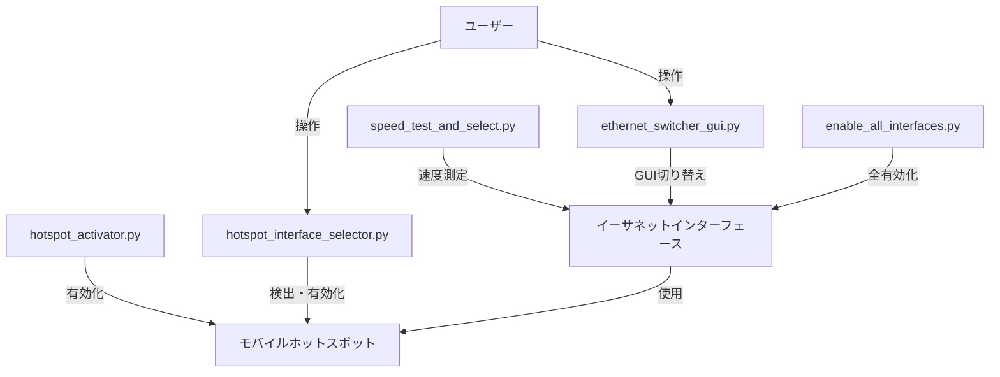

# BestEthernet

BestEthernetは、Pythonを使用してイーサネット接続の速度を測定し、最も高速な接続を自動的に選択するツールです。USBテザリングを有効にし、利用可能なイーサネット接続の中から最速のものを選択してアクティブにします。

## 主な機能

- USBテザリングの有効化
- 利用可能なイーサネット接続のリストアップ
- 各イーサネット接続のダウンロードおよびアップロード速度の測定
- 最速のイーサネット接続の自動選択とアクティブ化
- 速度測定結果のログ記録
- モバイルホットスポットの有効化

## ファイル構成と機能

### speed_test_and_select.py
- 機能: 全イーサネットインターフェースの速度測定と最速選択
- 出力: 速度ログ（txt, csv）

### ethernet_switcher_gui.py
- 機能: GUI経由でイーサネットインターフェース切り替え
- 入力: ユーザー選択

### hotspot_activator.py
- 機能: Windows 10モバイルホットスポット開始
- 出力: 結果表示または設定画面起動

### enable_all_interfaces.py
- 機能: 全イーサネットインターフェース有効化
- 出力: 処理結果

### hotspot_interface_selector.py
- 機能: モバイルホットスポット可能インターフェース検出と有効化
- 入力: GUI経由のユーザー選択
- 出力: 処理結果

## ethernet_switcher_gui.py と hotspot_interface_selector.py の使い分け

1. ethernet_switcher_gui.py
   - 用途: 一般的なイーサネットインターフェースの切り替え
   - 特徴: すべてのネットワークアダプターを表示し、選択したものを有効化
   - 使用時期: 通常のネットワーク接続の切り替えが必要な場合

2. hotspot_interface_selector.py
   - 用途: モバイルホットスポット機能に特化したインターフェース管理
   - 特徴: モバイルホットスポット可能なインターフェースのみを表示し、選択したものでホットスポットを有効化
   - 使用時期: モバイルホットスポットの設定や切り替えが必要な場合

選択基準:
- ネットワーク接続の一般的な切り替え → ethernet_switcher_gui.py
- モバイルホットスポットの設定や使用 → hotspot_interface_selector.py

## システム構成図



## 使用方法

1. すべてのインターフェースを有効化:
   ```
   python enable_all_interfaces.py
   ```

2. 速度測定と最速インターフェース選択:
   ```
   python speed_test_and_select.py
   ```

3. GUI経由でイーサネットインターフェース切り替え:
   ```
   python ethernet_switcher_gui.py
   ```

4. モバイルホットスポット開始:
   ```
   python hotspot_activator.py
   ```

5. モバイルホットスポット用インターフェース選択:
   ```
   python hotspot_interface_selector.py
   ```

## 注意事項

- 全スクリプトはWindows環境用です
- 一部の機能には管理者権限が必要な場合があります
- ネットワーク設定を変更するため、使用前にネットワーク接続のバックアップを取ることをお勧めします