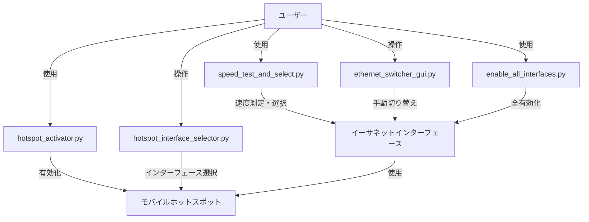

# BestEthernet ユーザーガイド

BestEthernet は、Windows 環境でイーサネット接続とモバイルホットスポットを最適化するためのツールセットです。

## こんなときは、このツールを使おう

### 最速のネットワーク接続を自動で選びたい
**使用ツール**: `speed_test_and_select.py`
```
python speed_test_and_select.py
```
- 全てのイーサネットインターフェースの速度を測定
- 最速の接続を自動で選択してアクティブ化
- 速度測定結果をログファイル（txt, csv）に記録

### ネットワーク接続を手動で切り替えたい
**使用ツール**: `ethernet_switcher_gui.py`
```
python ethernet_switcher_gui.py
```
- GUI でイーサネットインターフェースを一覧表示
- クリックで簡単に接続を切り替え

### モバイルホットスポットを開始したい
**使用ツール**: `hotspot_activator.py`
```
python hotspot_activator.py
```
- Windows 10 のモバイルホットスポット機能を有効化
- 自動で設定できない場合は設定画面を起動

### モバイルホットスポット用のインターフェースを選びたい
**使用ツール**: `hotspot_interface_selector.py`
```
python hotspot_interface_selector.py
```
- モバイルホットスポット可能なインターフェースを表示
- GUI で簡単に選択してホットスポットを有効化

### 全てのネットワークインターフェースを有効にしたい
**使用ツール**: `enable_all_interfaces.py`
```
python enable_all_interfaces.py
```
- システム上の全てのイーサネットインターフェースを有効化

## システム構成図



## 注意事項

- 全てのツールは Windows 環境専用です
- 管理者権限が必要な機能があります
