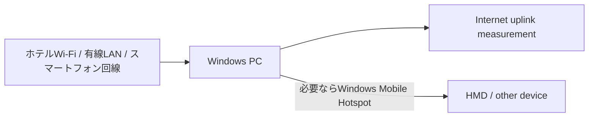

# BestEthernet

[](https://github.com/KAFKA2306/BestEthernet/actions/workflows/test-network-safety.yml)

Windowsで利用可能な複数回線を**その場で測定し、経路を確認し、証拠を残して選ぶ**ためのツールです。

## Canonical flow

BestEthernetの現在の回線選択pathは2段だけです。

1. `speed_test_and_select.py` — 候補adapterを安全に測定し、JSONL / CSVへ監査可能なsampleを保存する。
2. `network_readiness.py` — 同じjob IDの複数sampleをfail-closedで集計し、JSON / HTML reportを生成する。

```powershell
pip install -r requirements.txt
python speed_test_and_select.py --dry-run
python speed_test_and_select.py --job-id venue-001
python network_readiness.py `
  --job examples/network-readiness-job.json `
  --samples examples/network-readiness-measurements.jsonl `
  --output-dir examples/network-readiness-output `
  --public
```

`--dry-run` はnetwork stateとfileを変更しません。live measurementには`speedtest-cli`を使用します。

## Safety contract

`speed_test_and_select.py` は Windows の `Get-NetAdapter`、`Get-NetIPConfiguration`、`Get-NetRoute` からstructured stateを取得し、次を守ります。

- loopback、VPN、Hyper-V、WSL、Bluetooth、TAP、TUN、WireGuard等を既定で候補から除外する。
- speedtestを候補adapterのsource IPv4へbindする。
- requested interfaceとactual egressが一致しない測定を採用しない。
- adapterを分離する場合も、成功・例外・KeyboardInterrupt後に実行前のadministrative stateへ復元する。
- 最初からdisabledだったadapterを勝手にenableしない。
- routeは監査のために読むだけで変更しない。
- sampleへsource IP、gateway、measurement server、timestamp、latency、download、upload、success/failure reason、任意のjob IDを残す。

`network_readiness.py` はcandidateごとに最低3 sampleを要求し、失敗sample、egress mismatch、不正値、job ID不一致を正常値として集計しません。十分な証拠がなければ`INSUFFICIENT_EVIDENCE`とし、primary / fallbackを作りません。

公開reportではsource IP / gatewayをmaskできます。

## Network topology


```mermaid
graph LR
    A[ホテルWi-Fi / 有線LAN / スマートフォン回線] --> B[Windows PC]
    B --> C[Internet uplink measurement]
    B -->|必要ならWindows Mobile Hotspot| D[HMD / other device]
```

このrepositoryが測定する中心はPCからInternetへのuplinkです。PC↔HMDのlocal wireless link品質は別経路であり、internet speed testだけでは評価できません。

Windows Mobile Hotspot自体はOSの機能を使用してください。このrepositoryには、adapterを無条件に有効化したり、復元契約なしでinterfaceを切り替えたりする別のnetwork mutation helperは維持しません。

## Example readiness report

合成sampleから生成した例を保持しています。

- `examples/network-readiness-job.json`
- `examples/network-readiness-measurements.jsonl`
- `examples/network-readiness-output/network-readiness.json`
- `examples/network-readiness-output/network-readiness.html`

会場診断MVPの範囲と制約は [`docs/business/vr-network-readiness.md`](docs/business/vr-network-readiness.md) を参照してください。

## VR / VRChatについて

readiness thresholdは利用者が設定するscreening条件です。VR、VRChat、HMD、会場Wi-Fi、イベント成功、SLAを保証しません。

VRChat公式System Requirementsはnetworkについて `Broadband Internet Connection (25+ megabit preferred)` としています。このrepositoryでは、過去に使われていた100 / 150 MbpsをVRChat一般要件として扱いません。

- VRChat System Requirements: https://help.vrchat.com/hc/en-us/articles/1500002378722-System-Requirements
- Windows Mobile Hotspot: https://support.microsoft.com/windows/use-your-windows-device-as-a-mobile-hotspot-c89b0fad-72d5-41e8-f7ea-406ad9036b85

## Verification

```powershell
python -m unittest discover -s tests -v
```

GitHub Actionsの`Test network safety`はmeasurement binding、adapter rollback、dry-run、failure records、readiness aggregationを実network変更なしで検証します。

## Separate active subtree: ZeroTrustDNS

`zero_trust_dns/` は回線選択pathとは別のactive security PoCです。AdGuard Home / Tailscaleを使うprivate DNS、Windows one-click installer、Android companionをそれぞれ独立CIで検証しています。

- [`zero_trust_dns/README.md`](zero_trust_dns/README.md)

BestEthernetの回線測定・readinessとZeroTrustDNSを同一のruntime/control pathとして扱いません。
