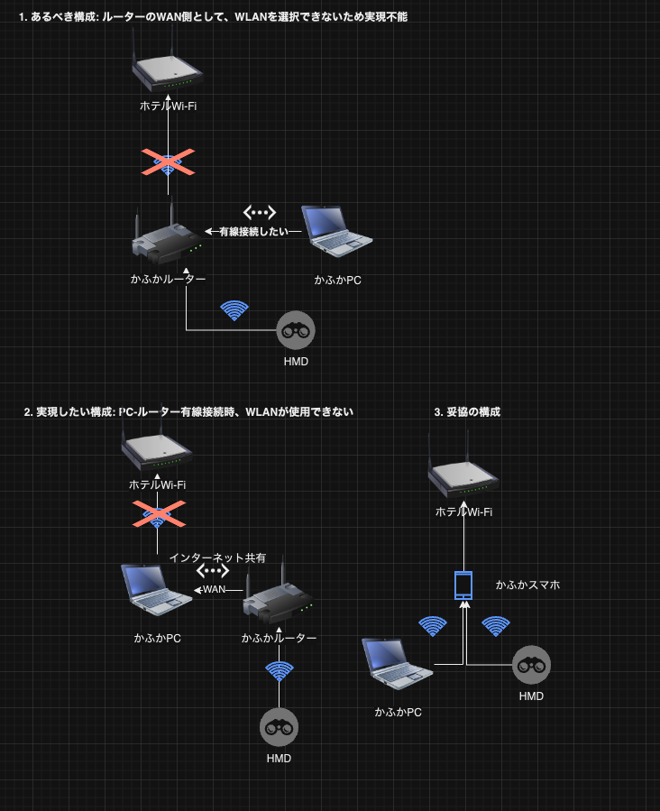

# VRネットワーク最適化プロジェクト：BestEthernet

## 1. プロジェクトの背景と目的

VR（仮想現実）体験の品質を最大化するためには、安定した高速ネットワーク接続が不可欠です。本プロジェクトは、多様なネットワーク環境（ホテルWi-Fi、モバイルデータ等）での安定運用を目指し、以下の要件を満たすソリューションの開発を目的としています：

- 必要なビットレート：最低100 Mbps、推奨150 Mbps
- 多様なネットワーク環境での安定運用

## 2. ネットワーク構成の問題点

以下の画像は、異なるネットワーク構成とその問題点を示しています：



この画像には、3つの異なるネットワーク構成が示されています：

1. **理想的な構成（問題あり）**：
   - ホテルWi-Fi → かふかルーター → HMD
   - この構成では、ルーターがWANとしてWLANを選択できない問題が指摘されています。

2. **実現しない構成**：
   - ホテルWi-Fi → かふかPC（イーサネット共有） → かふかルーター → HMD
   - この構成では、PC-ルーター間の有線接続が実現できない問題があります。

3. **妥協の構成**：
   - ホテルWi-Fi → かふかスマホ → かふかPC → HMD
   - この構成は、前述のBestEthernetソリューションに近い形態です。

これらの構成の問題点を解決するために、BestEthernetソリューションでは、PCを中心としたホットスポット接続を採用しています。

## 3. BestEthernetソリューション

### 3.1 ネットワーク構成

プロジェクトで採用した最適なネットワーク構成は、PC経由のホットスポット接続です。


**説明**：
- PCがホテルWi-FiまたはスマホのUSBテザリングで接続
- PCでWindows標準のモバイルホットスポット機能を有効化
- HMDとその他のデバイスがPCのホットスポットに接続

**利点**：
1. 柔軟性：ホテルWi-Fiとスマホ回線の両方に対応可能
2. 安定性：PCを介することで接続の安定性が向上
3. パフォーマンス：PCの処理能力を活用して最適な接続を維持

### 3.2 BestEthernetアプリケーション

環境に応じて最適なネットワーク接続を自動的に選択・設定するBestEthernetアプリケーションを開発しました。

#### 主な機能
1. 利用可能なネットワークの検出
2. 各ネットワークの速度とパフォーマンスのリアルタイム測定
3. VR要件に基づく最適なネットワークの自動選択
4. 選択されたネットワークへの自動接続とPCホットスポットの設定
5. ユーザーインターフェースを通じた手動制御オプション

#### 動作フロー
1. アプリ起動時に利用可能なすべてのネットワークをスキャン
2. 各ネットワークの速度テストを実行（`speed_test_and_select.py`）
3. 最高のパフォーマンスを示すネットワークを選択
4. 選択されたネットワークに自動接続
5. PCのモバイルホットスポット機能を自動的に有効化（`hotspot_activator.py`）
6. 接続状態を継続的にモニタリングし、必要に応じて再最適化

## 5. BestEthernetユーザーガイド

### 5.1 主要機能と使用方法

#### 最速のネットワーク接続を自動で選択
**使用ツール**: `speed_test_and_select.py`
```
python speed_test_and_select.py
```

#### ネットワーク接続を手動で切り替え
**使用ツール**: `ethernet_switcher_gui.py`
```
python ethernet_switcher_gui.py
```

#### モバイルホットスポットを開始
**使用ツール**: `hotspot_activator.py`
```
python hotspot_activator.py
```

#### モバイルホットスポット用のインターフェースを選択
**使用ツール**: `hotspot_interface_selector.py`
```
python hotspot_interface_selector.py
```

#### 全てのネットワークインターフェースを有効化
**使用ツール**: `enable_all_interfaces.py`
```
python enable_all_interfaces.py
```

### 5.2 システム構成図


### 5.3 注意事項とトラブルシューティング

- すべてのツールはWindows環境専用です。
- 一部の機能には管理者権限が必要です。


## 4. 実績データ事例

### 4.1 データ概要

- **期間**: 2024年3月2日 〜 2024年10月22日
- **総測定回数**: 54回
- **分析対象ネットワーク**: 
  1. hotel/イーサネット
  2. iPhone (Vodafone)
  3. Android (O2)

## 2. ネットワーク別パフォーマンス

### 2.1 hotel/イーサネット
- **測定回数**: 31回
- **平均速度**: 10.1 Mbps (ダウンロード) / 16.0 Mbps (アップロード)
- **最高速度**: 114.2 Mbps (ダウンロード) / 82.6 Mbps (アップロード)
- **最低速度**: 0.1 Mbps (ダウンロード) / 0.5 Mbps (アップロード)
- **特徴**: 極端な速度変動、安定性に欠ける

### 2.2 iPhone (Vodafone)
- **測定回数**: 9回
- **平均速度**: 73.4 Mbps (ダウンロード) / 32.8 Mbps (アップロード)
- **最高速度**: 129.9 Mbps (ダウンロード) / 55.4 Mbps (アップロード)
- **最低速度**: 24.8 Mbps (ダウンロード) / 11.8 Mbps (アップロード)
- **特徴**: 高速で安定、VR要件を満たす可能性が高い

### 2.3 Android (O2)
- **測定回数**: 7回
- **平均速度**: 18.6 Mbps (ダウンロード) / 9.6 Mbps (アップロード)
- **最高速度**: 24.8 Mbps (ダウンロード) / 11.9 Mbps (アップロード)
- **最低速度**: 4.0 Mbps (ダウンロード) / 2.9 Mbps (アップロード)
- **特徴**: 中程度の速度、比較的安定

## 3. 時系列分析

### 3.1 期間別の傾向
1. **初期 (3月2日〜3日)**
   - iPhoneが最高速度を記録
   - hotel/イーサネットで大きな速度変動

2. **中期 (3月4日〜8日)**
   - 全体的に速度が低下し安定化
   - O2とhotel/イーサネットが似たパフォーマンス

3. **後期 (10月22日)**
   - hotel/イーサネットが大幅に改善
   - O2は中期と同程度のパフォーマンス

### 3.2 VR要件 (100 Mbps) 達成率
- hotel/イーサネット: 6.5% (2/31回)
- iPhone (Vodafone): 33.3% (3/9回)
- Android (O2): 0% (0/7回)

## 4. 主要な観察結果

1. **明確なパフォーマンス階層**:
   iPhone > O2 > hotel/イーサネット

2. **hotel/イーサネットの不安定性**:
   同日内で82.6 Mbpsから24.1 Mbpsへの急激な低下を観測

3. **iPhoneの一貫した高性能**:
   全測定で24 Mbps以上を記録

4. **O2の安定した中程度のパフォーマンス**:
   VR要件には不十分だが、一貫性がある

### 4.3 重要な観察事項

1. **ネットワーク変動**：同じネットワークでも日や時間帯によって大きく性能が変動。
2. **VR要件達成率**：
   - ホテルWi-Fi：16.7% (3/18回)
   - モバイルデータ：23.1% (3/13回)
   - 有線接続：0% (0/13回)
3. **最適ネットワークの日変動**：日によって最適なネットワークが異なる。
4. **長期的傾向**：3月初旬は大きな変動と高速接続の機会があったが、中旬以降は全体的に安定し、速度は低下（約24/12 Mbps前後）。


## 6. 結論

BestEthernetソリューションは、PCを中心としたネットワーク構成と自動最適化アプリケーションにより、多様な環境下でのVR体験に必要な高品質なネットワーク接続を実現しました。具体的なネットワーク構成図と実績データ分析により、本ソリューションの有効性が示されています。
