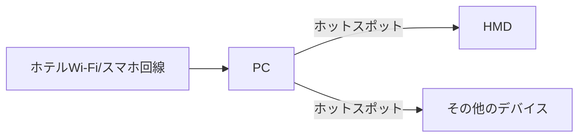

# VRネットワーク最適化プロジェクト：最終解決策

## 1. プロジェクトの背景と目的

VR体験の品質を最大化するためには、安定した高速ネットワーク接続が不可欠です。
- 必要なビットレート：最低100 Mbps、推奨150 Mbps
- 多様なネットワーク環境（ホテルWi-Fi、モバイルデータ等）での安定運用が必要

## 2. 最適なネットワーク構成

### 2.1 中心となる構成：PC経由のホットスポット接続

**説明**：
- PCがホテルWi-FiまたはスマホのUSBテザリングで接続
- PCでWindows標準のモバイルホットスポット機能を有効化
- HMDとその他のデバイスがPCのホットスポットに接続

**利点**：
1. 柔軟性：ホテルWi-Fiとスマホ回線の両方に対応可能
2. 安定性：PCを介することで接続の安定性が向上
3. パフォーマンス：PCの処理能力を活用して最適な接続を維持

## 3. BestEthernetアプリの開発

環境に応じて最適なネットワーク接続を自動的に選択・設定するBestEthernetアプリを開発しました。

### 3.1 主な機能
1. 利用可能なネットワーク（ホテルWi-Fi、スマホ回線）の検出
2. 各ネットワークの速度とパフォーマンスのリアルタイム測定
3. VR要件に基づく最適なネットワークの自動選択
4. 選択されたネットワークへの自動接続とPCホットスポットの設定
5. ユーザーインターフェースを通じた手動制御オプション

### 3.2 動作フロー
1. アプリ起動時に利用可能なすべてのネットワークをスキャン
2. 各ネットワークの速度テストを実行（`speed_test_and_select.py`）
3. 最高のパフォーマンスを示すネットワークを選択
4. 選択されたネットワークに自動接続
5. PCのモバイルホットスポット機能を自動的に有効化（`hotspot_activator.py`）
6. 接続状態を継続的にモニタリングし、必要に応じて再最適化

## 4. 課題と解決策

### 4.1 ホテルWi-Fiの不安定性
- **解決策**: アプリが定期的に接続品質をチェックし、必要に応じてスマホ回線に切り替え

### 4.2 スマホ回線の速度変動
- **解決策**: 複数のスマホ回線を同時に利用可能にし、最適なものを選択

### 4.3 PCホットスポットの制限
- **解決策**: Windows APIを使用して、ホットスポットの詳細設定（チャンネル、帯域幅等）を最適化

## 5. 結論

PCを中心としたネットワーク構成と、BestEthernetアプリの開発により、多様な環境下でのVR体験に必要な高品質なネットワーク接続を実現しました。この解決策は、ホテルWi-Fiとスマホ回線の両方に対応し、環境に応じて最適な接続を自動的に選択・維持することができます。

## 6. 実績データ分析

実際の使用データに基づく詳細な分析結果は、`examples.md`ファイルに記録されています。この分析により、我々の解決策の効果と今後の改善点が明確になりました。

## 7. ユーザーガイド

BestEthernetアプリの使用方法と各ツールの詳細については、`README.md`ファイルを参照してください。このガイドは、ユーザーがシステムを最大限に活用できるよう設計されています。